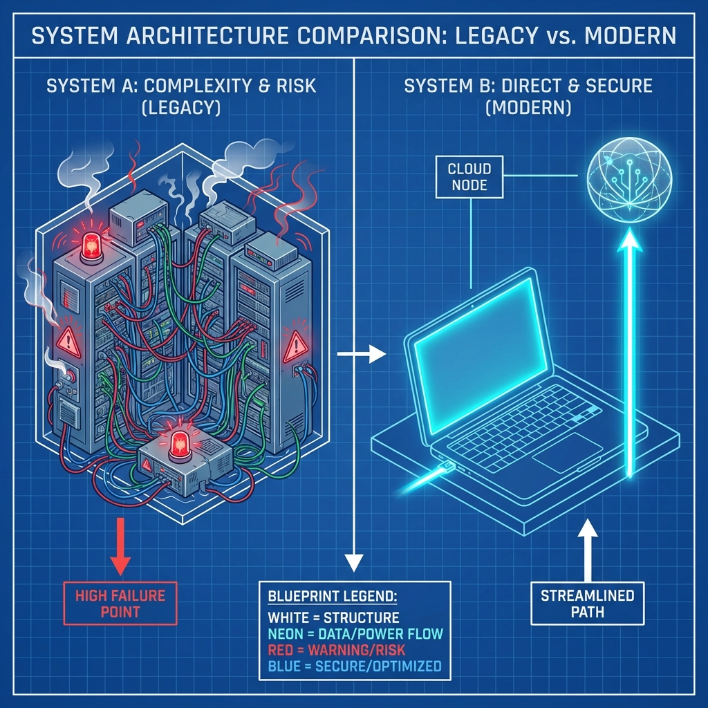

<p align="center">
  
</p>

<p align="center">
  
  
  
  
  
</p>

<h1 align="center">The Universal Client-Side AI SDK</h1>

<p align="center">
  <strong>One SDK. 12+ Providers. Zero Server Trust.</strong><br>
  <em>Connect directly to OpenAI, Anthropic, Gemini, and more from your user's browser.<br>Your keys never leave the device.</em>
</p>

<br>

<p align="center">
  <a href="#-quick-start"><strong>Get Started</strong></a> · 
  <a href="docs/API.md"><strong>API Docs</strong></a> · 
  <a href="https://github.com/nranjan2code/sutraworks-clientAISDK/issues"><strong>Report Bug</strong></a>
</p>

<br>

## ⚡️ The Paradigm Shift

Traditional AI integrations require you to proxy every request through your own server to hide API keys. This adds latency, cost, and a massive security liability.

**Sutraworks flips the model.**

<p align="center">
  
</p>

We enable a **Bring Your Own Key (BYOK)** architecture where users provide their own keys, and the SDK handles secure, direct communication with AI providers.

---

## 🔐 Enterprise-Grade Security


Security isn't an afterthought; it's the core of our architecture.

*   **Zero-Trust Model:** Keys are never sent to our servers or yours. They stay in the browser.
*   **Military-Grade Encryption:** AES-256-GCM authenticated encryption for all stored keys.
*   **OWASP 2024 Compliant:** PBKDF2 key derivation (600k iterations) and SHA-512 hashing.
*   **Key Rotation & Expiry:** Native support for key rotation and auto-clearing sensitive data.
*   **Memory Safety:** Secure memory wiping and constant-time comparisons to prevent timing attacks.

<br clear="all">

---

## 🚀 Quick Start

### 1. Installation

```bash
npm install @sutraworks/client-ai-sdk
```

### 2. Usage

```typescript
import { SutraAI } from '@sutraworks/client-ai-sdk';

// Initialize the client (secure by default)
const ai = new SutraAI();

// secure: Set user's key (stored locally, encrypted)
await ai.setKey('openai', 'sk-proj-...');

// direct: Chat directly with the provider
const response = await ai.chat({
  provider: 'openai',
  model: 'gpt-4-turbo',
  messages: [{ role: 'user', content: 'Design a spaceship.' }]
});

console.log(response.choices[0].message.content);
```

### 3. Streaming (Standardized)

```typescript
for await (const chunk of ai.chatStream({
  provider: 'anthropic',
  model: 'claude-3-opus-20240229',
  messages: [{ role: 'user', content: 'Write a haiku about rust.' }]
})) {
  process.stdout.write(chunk.choices[0]?.delta?.content ?? '');
}
```

---

## 🌐 Universal Provider Support

Switch providers with a single line of code. No more juggling different SDKs.

| Provider | Chat | Streaming | Vision | Tools |
|----------|:----:|:---------:|:------:|:-----:|
| **OpenAI** | ✅ | ✅ | ✅ | ✅ |
| **Anthropic** | ✅ | ✅ | ✅ | ✅ |
| **Google Gemini** | ✅ | ✅ | ✅ | ❌ |
| **Ollama (Local)** | ✅ | ✅ | ✅ | ❌ |
| **Mistral** | ✅ | ✅ | ❌ | ❌ |
| **Groq** | ✅ | ✅ | ❌ | ❌ |
| **Cohere** | ✅ | ✅ | ❌ | ❌ |
| **Perplexity** | ✅ | ✅ | ❌ | ❌ |

*Also supporting: Together AI, Fireworks, DeepSeek, xAI (Grok)*

---

## 🧰 Powerful Middleware System

Chain middleware to add logging, rate limiting, retries, or fallbacks.

```typescript
import { createRetryMiddleware, createFallbackMiddleware } from '@sutraworks/client-ai-sdk';

ai.use(createRetryMiddleware({ maxRetries: 3 }))
  .use(createFallbackMiddleware({
    // If OpenAI fails, automatically try Anthropic
    fallbacks: { openai: ['anthropic'] } 
  }));
```

---

## 📄 License & Contributing

MIT Licensed. Open source and free to use.

Contributing? Please read our [CONTRIBUTING.md](CONTRIBUTING.md) guide.

<p align="center">
  <sub>Built by Sutraworks. Designed for the future of the web.</sub>
</p>
