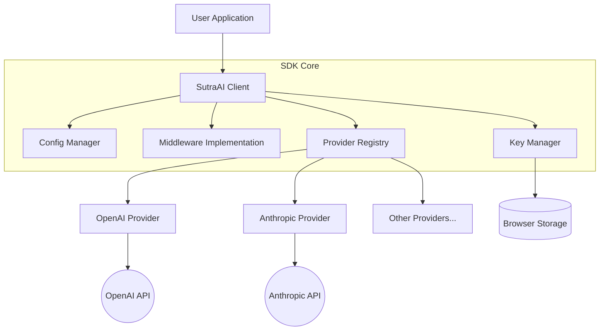
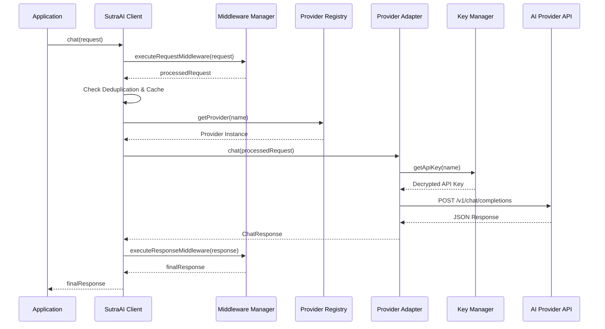
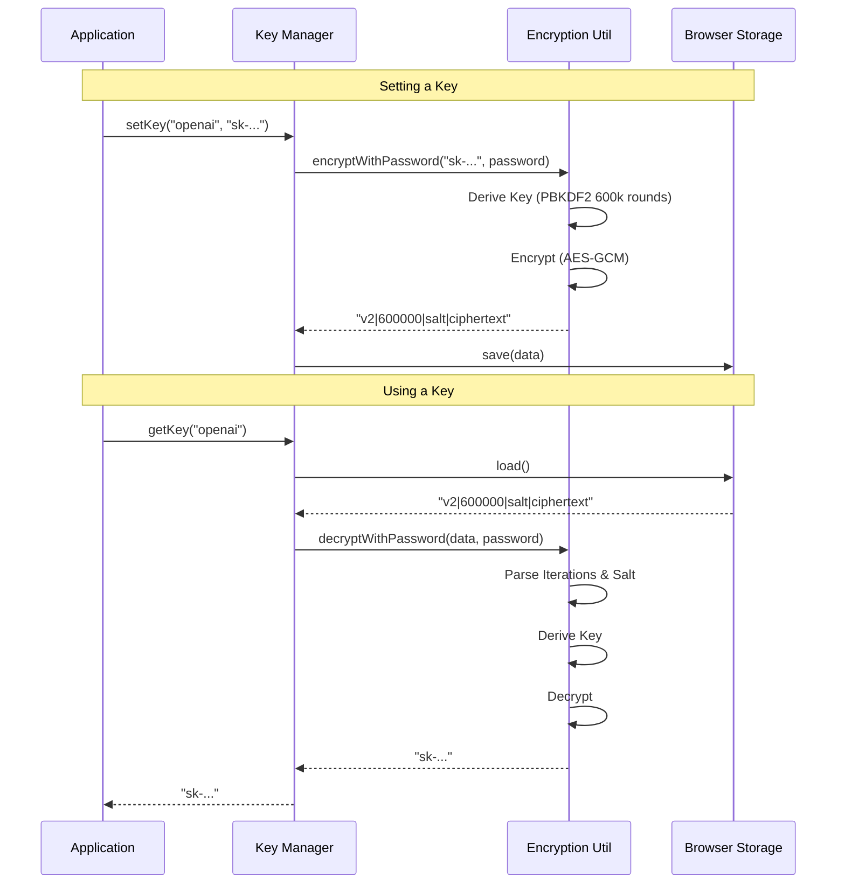

# Architecture Guide

This document provides a high-level overview of the internal architecture of the `@sutraworks/client-ai-sdk` (v2.0).

## System Overview

The SDK is designed as a modular, client-side runtime for AI applications. It strictly adheres to a "Bring Your Own Key" (BYOK) architecture, ensuring that sensitive API keys never leave the client's device except when communicating directly with AI providers.

## Core Components

### 1. SutraAI Client (`src/core/client.ts`)
The main entry point. It orchestrates the interaction between the user's request, the middleware pipeline, and the provider registry. It manages the lifecycle of resources (events, timers) and ensures ensuring clean cleanup via `destroy()`.

### 2. Middleware Pipeline (`src/middleware/`)
All requests to the SDK pass through a middleware chain before reaching a provider. This allows for:
- **Validation**: Checking request schemas.
- **Resilience**: Retrying failed requests (exponential backoff).
- **Observability**: Logging and metrics collection.
- **Safety**: Content filtering and sanitization.

### 3. Provider Registry (`src/core/registry.ts`)
Manages the lifecycle of AI provider instances.
- **Dynamic Loading**: Providers are lazy-loaded only when requested.
- **Circuit Breakers**: Each provider is wrapped in a circuit breaker to fail fast during outages.
- **Plugin System**: Allows registering custom providers at runtime without forking the SDK.

### 4. Key Manager (`src/keys/manager.ts`)
Handles the secure storage and retrieval of API keys.
- **Storage Abstraction**: Supports `Memory`, `LocalStorage`, `SessionStorage`, and `IndexedDB`.
- **Encryption**: Uses AES-256-GCM to encrypt keys at rest using a user-provided password or ephemeral keys.
- **Race Condition Protection**: Uses an internal mutex to prevent race conditions during key reads/writes in async environments.

## Request Flow

The following sequence diagram illustrates the flow of a `chat()` completion request.

## Key Storage Security Flow

How keys are securely stored and retrieved using the PBKDF2 + AES-GCM encryption scheme.

